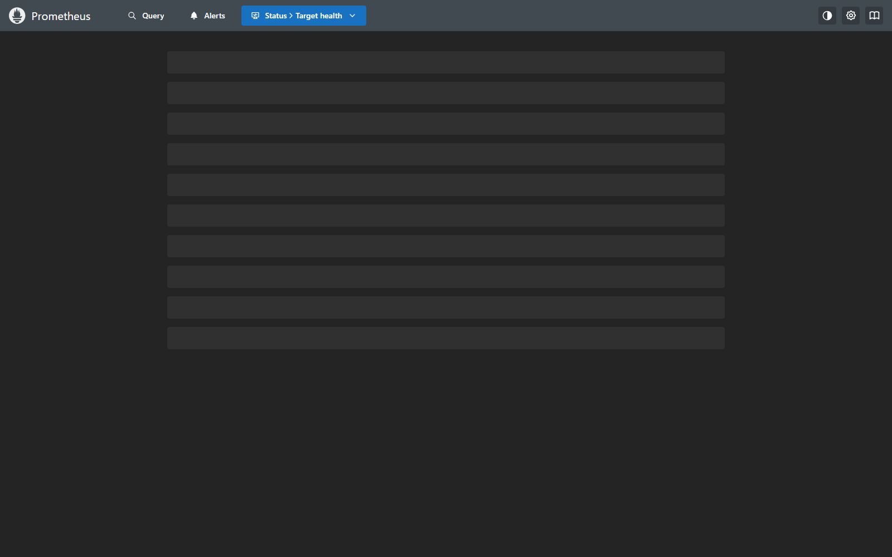
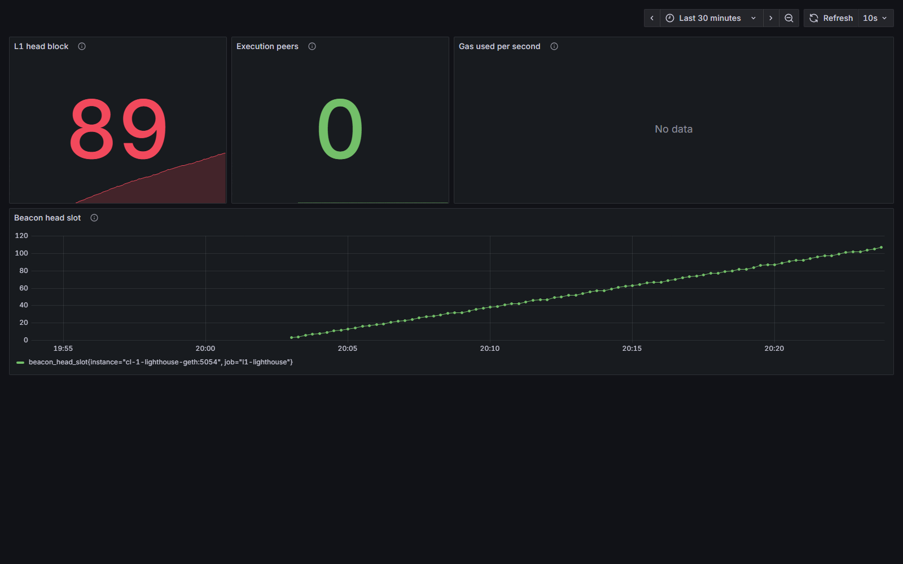
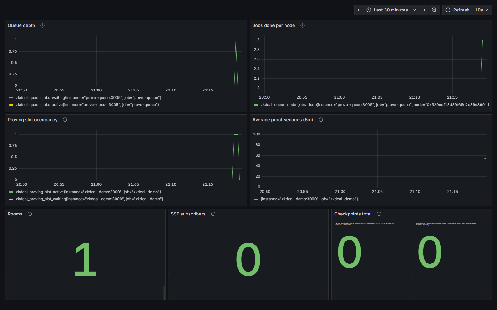
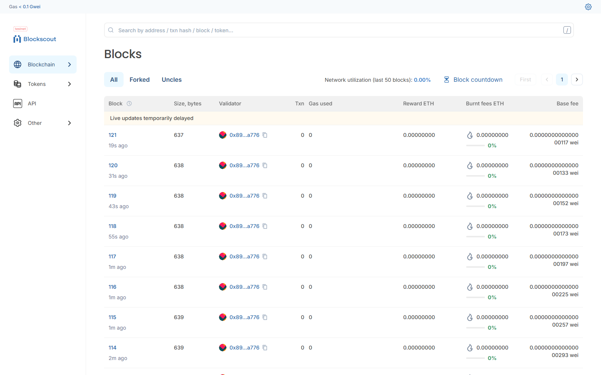
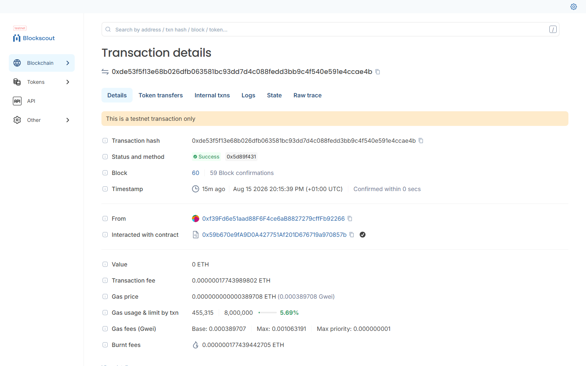
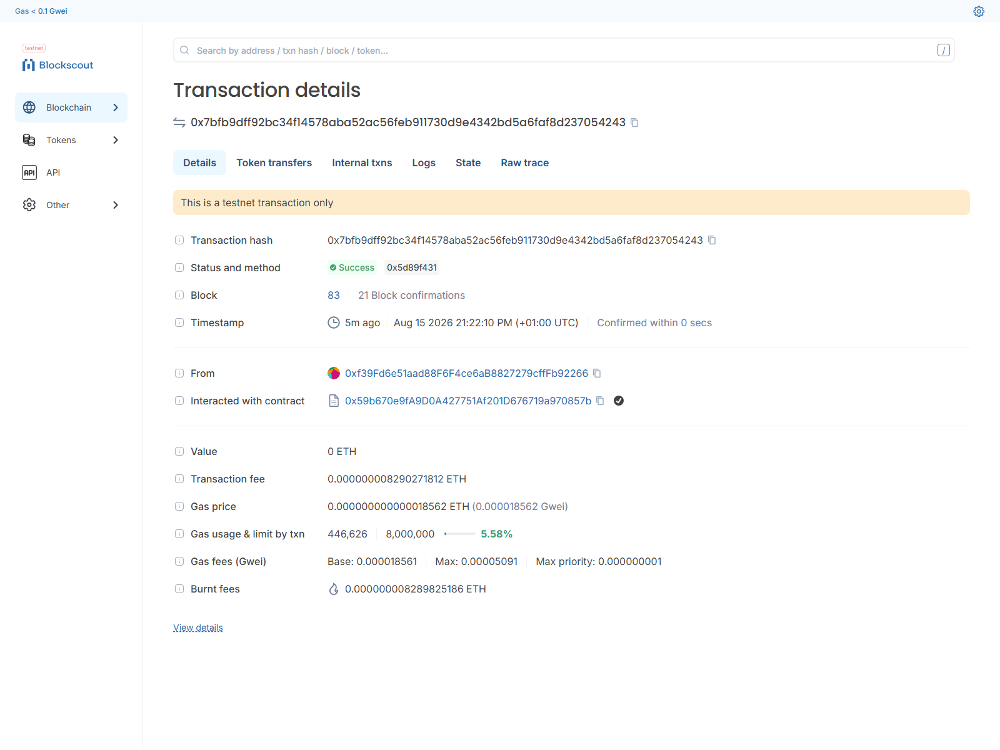
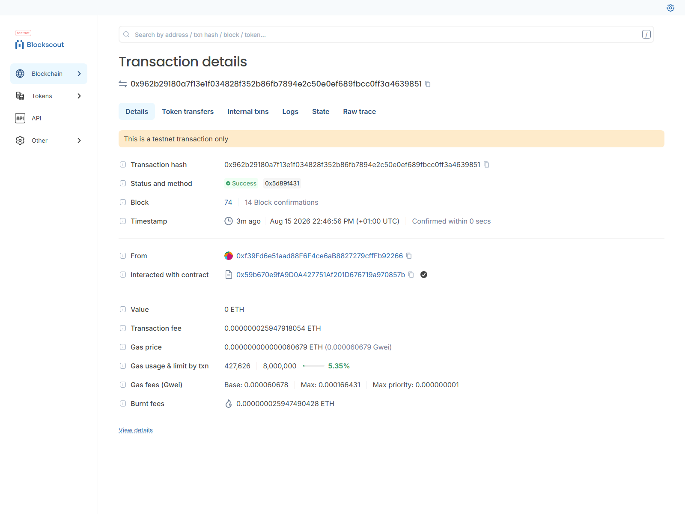
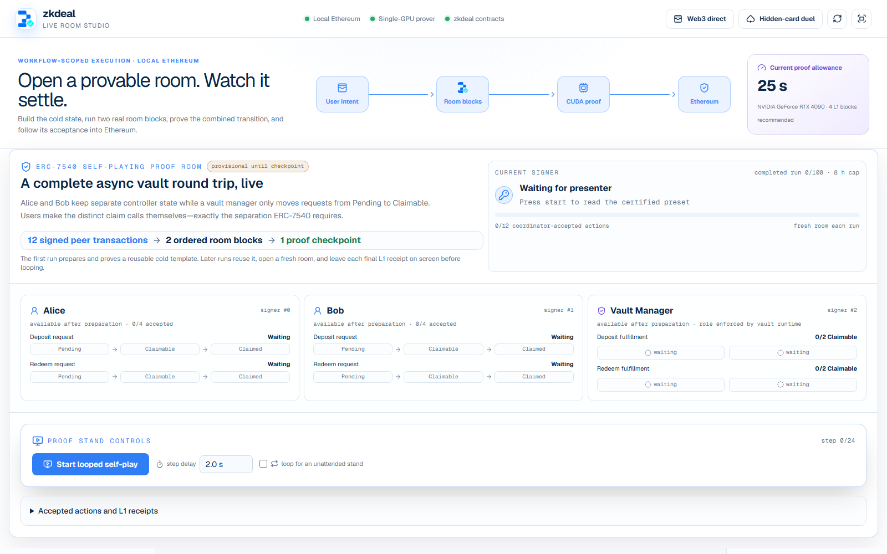
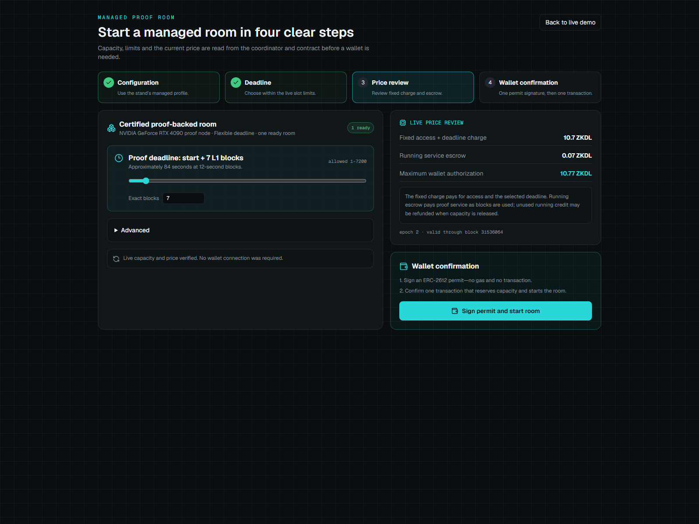

# Observability

Every enclave this package starts carries an always-on observability pair,
declared in `package/observability.star`:

- **Prometheus** on host port **9090**, scraping every metrics surface in the
  enclave over in-enclave DNS;
- **Grafana** on host port **3300**, anonymous and read-only (login form
  disabled, org role `Viewer`, no sign-up, no analytics), provisioned from the
  checked-in datasource, provider and dashboard files under
  `package/observability/grafana/`.

Both are CPU-only, so they take nothing from the single-GPU budget the prover
owns, and both start **before** the blocking bootstrap: the 45-minute
acceptance run is exactly the window an operator wants to watch live instead
of staring at a silent `kurtosis run`. Targets that do not exist yet - the
coordinator appears only after the bootstrap - simply show as down until they
come up.

## Fixed host ports

| Host port | Surface | Notes |
| --- | --- | --- |
| 3000 | Upstream blockscout-frontend (ethereum-package) | Host-browser only: it hardcodes `127.0.0.1`, so it only renders for a browser on the Docker host itself. |
| 3100 | Demo UI / coordinator (`zkdeal-demo`) | Plain-http twin of the https origin below. |
| 3200 | `explorer` (this package's Blockscout frontend) | The correct explorer to use - it works from browsers that are not on the Docker host. |
| 3300 | Grafana | Anonymous read-only dashboards. 3300 rather than Grafana's native 3000, which the upstream frontend already holds. |
| 8443 | `tls-gateway` (https origin) | The origin to hand a visitor; required for the card duel's `crypto.subtle`. |
| 9090 | Prometheus | Raw metrics browser and PromQL console. |

## Scrape topology

Rendered into `prometheus.yml` by `observability.star`; global scrape interval
5 s, scrape timeout 4 s, in-enclave DNS names throughout.

| Job | Target | Port | Path | What it tells you |
| --- | --- | --- | --- | --- |
| `l1-geth` | `el-1-geth-lighthouse` | 9001 | `/debug/metrics/prometheus` | Execution head block, gas throughput, peer count - is the chain moving. |
| `l1-lighthouse` | `cl-1-lighthouse-geth` | 5054 | `/metrics` | Beacon head slot and sync state - one slot every 12 s or the devnet stalled. |
| `l1-validator` | `vc-1-geth-lighthouse` | 8080 | `/metrics` | Validator duties and attestation health for the single participant. |
| `zkdeal-demo` | `zkdeal-demo` | 3000 | `/metrics` | Rooms, SSE subscribers, proving-slot occupancy, proof-latency histogram, checkpoints committed. |
| `prover` | `risc0-cuda-prover` | 8080 | `/metrics` | GPU utilization/memory/power, request outcomes by route, uptime. |
| `prove-queue` | `prove-queue` | 3005 | `/metrics` | Waiting vs active jobs and per-node completions. Scraped only when the enclave runs with `prove_queue: true`. |

## The 0.5 s batching policy

No consumer in this stack is allowed to poll a producer faster than the
producer makes new data, and the floors nest:

- **SSE coalescing: 500 ms** - the coordinator batches room events onto a
  half-second floor before they reach any subscriber;
- **GPU probe cache: 2 s** - the prover answers metrics reads from a cached
  device probe, so scraping it costs the GPU nothing;
- **Prometheus scrape: 5 s** - slower than every emission floor above, so a
  scrape can never be the thing that makes a target busy.

Grafana's provisioned dashboards refresh on top of that scrape; sub-second
spikes are invisible by design, which is the correct trade for a stand whose
fastest honest signal is the 500 ms SSE floor.

## Dashboards

Three checked-in dashboards, provisioned read-only (UI edits are disabled; the
repository is the source of truth):

- **L1 overview** (`zkdeal-l1`) - head block, peers, gas throughput, beacon
  head slot. Metric names were finalized against the live scrape of the 4090
  stand (geth's throughput gauge is `chain_mgasps`).
- **zkdeal proving pipeline** (`zkdeal-proving`) - queue depth, per-node
  completions, proving-slot occupancy, average proof seconds, rooms, SSE
  subscribers, checkpoints.
- **CUDA prover** (`zkdeal-gpu`) - GPU utilization, memory, power, request
  outcomes, uptime.

## Screenshots

All captures below come from live RTX 4090 acceptance runs (2026-08-15,
SEGMENT_PO2=20, real CUDA Groth16 proofs accepted on the local L1).

### Prometheus targets

### L1 overview

### CUDA prover under a real proof

### Proving pipeline

### Block explorer

Per-example checkpoint transactions, each carrying a real CUDA Groth16 proof
accepted by the L1 RoomManager:

### Coordinator surfaces

